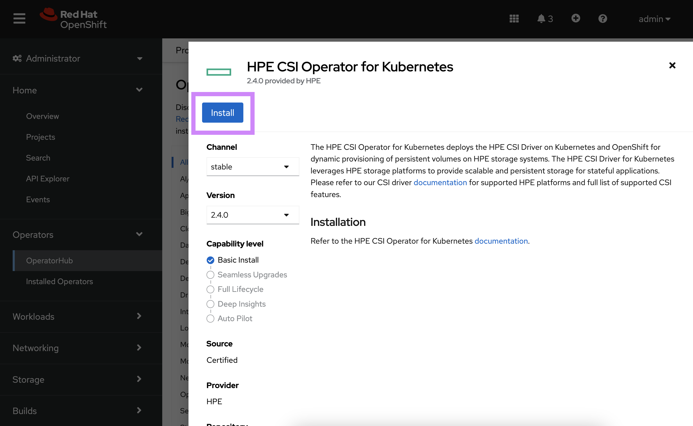
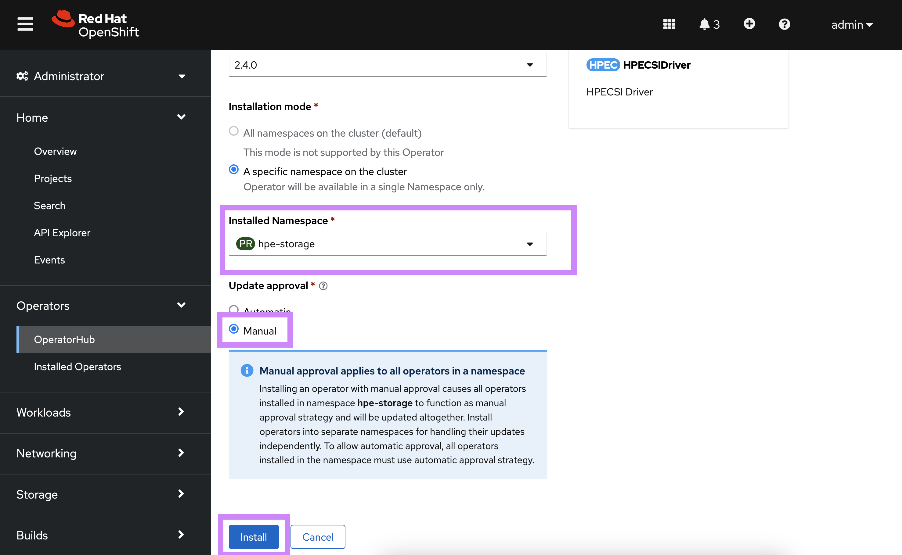
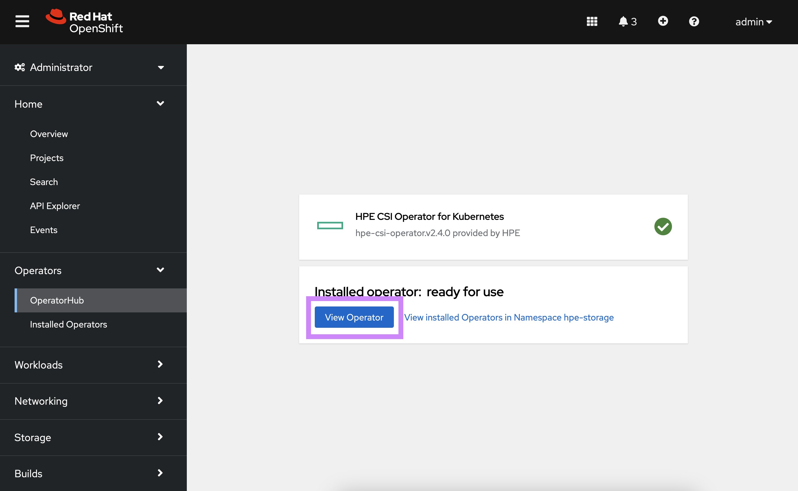
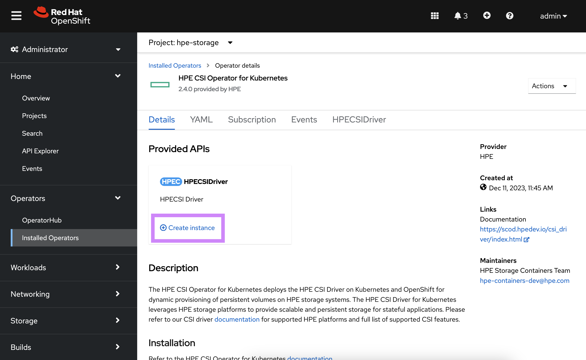
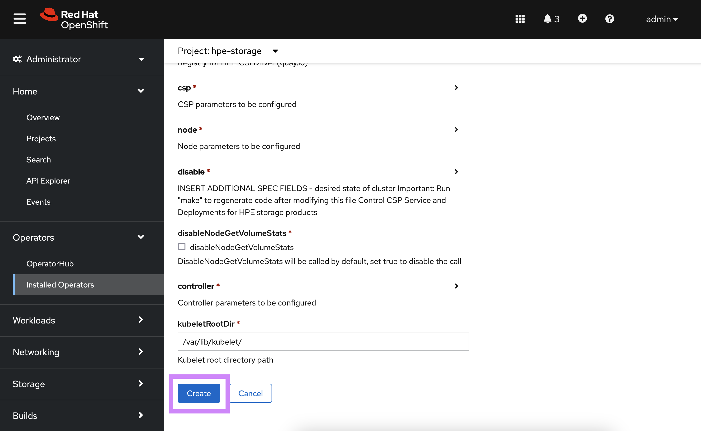

# Overview

HPE and Red Hat have a long standing partnership to provide jointly supported software, platform and services with the absolute best customer experience in the industry.

Red Hat OpenShift uses open source Kubernetes and various other components to deliver a PaaS experience that benefits both developers and operations. This packaged experience differs slighty on how you would deploy and use the HPE volume drivers and this page serves as the authoritive source for all things HPE primary storage and Red Hat OpenShift.

[TOC]

## OpenShift 4

Software deployed on OpenShift 4 follows the [Operator pattern](https://kubernetes.io/docs/concepts/extend-kubernetes/operator/). CSI drivers are no exception.

### Certified combinations

Software delivered through the HPE and Red Hat partnership follows a rigorous certification process and only qualify what's listed in the following table.

| Status        | Red Hat OpenShift | HPE CSI Operator | Container Storage Providers |
| ------------- | ----------------- | ---------------- | --------------------------- |
| Certified     | 4.2               | 1.1.0            | Nimble, 3PAR and Primera    |
| Certified     | 4.3               | 1.1.0            | Nimble                      |

Check this table periodically for future releases.

!!! seealso "Pointers"
    Other combinations may work but will not be supported.  
    Both Red Hat Enterprise Linux and Red Hat CoreOS worker nodes are supported.

### Deployment

The HPE CSI Operator for Kubernetes needs to be installed through the interfaces provided by Red Hat. Do not follow the instructions found on OperatorHub.io. 

#### Prerequisites

The HPE CSI Driver needs to run in privileged mode and needs access to host ports, host network and should be able to mount hostPath volumes. Hence, before deploying HPE CSI Operator on OpenShift, please create the following `SecurityContextConstraints` (SCC) to allow the CSI driver to be running with these privileges.

Download the SCC to where you have access to `oc` and the OpenShift cluster:

```markdown
curl -sL https://raw.githubusercontent.com/hpe-storage/co-deployments/master/operators/hpe-csi-operator/deploy/scc.yaml > hpe-csi-scc.yaml
```

Change `my-hpe-csi-driver-operator` to the name of the project (e.g. `hpe-csi-driver` below) where the CSI Operator is being deployed.

```markdown
oc new-project hpe-csi-driver --display-name="HPE CSI Driver for Kubernetes"
sed -i 's/my-hpe-csi-driver-operator/hpe-csi-driver/g' hpe-csi-scc.yaml
```

Deploy the SCC:

```markdown
oc create -f hpe-csi-scc.yaml
securitycontextconstraints.security.openshift.io/hpe-csi-scc created
```

!!! important
    Make note of the project name as it's needed for the Operator deployment in the next steps.

#### Caveats

At this time of writing (CSI Operator 1.1.0) the default `StorageClass` being shipped with the CSI driver is not very useful for OpenShift as it doesn't allow applications to write in the `PersistentVolumes`. Make sure to deploy a new `StorageClass` with `.parameters.fsMode` set to `"0770"`. This caveat will be removed in subsequent releases.

* Learn how to create a base `StorageClass` in [using the CSI driver](csi_driver/using.md#base_storageclass_parameters).

#### OpenShift CLI

This provides an example Operator deployment using `oc`. If you want to use the web console, proceed to the [next section](#openshift_web_console).

It's assumed the SCC has been applied to the project and have `kube:admin` privileges. As an example, we'll deploy to the `hpe-csi-driver` project as described in previous steps.

First, an `OperatorGroup` needs to be created.

```yaml
apiVersion: operators.coreos.com/v1
kind: OperatorGroup
metadata:
  name: hpe-csi-driver-for-kubernetes
  namespace: hpe-csi-driver
spec:
  targetNamespaces:
  - hpe-csi-driver
```

Next, create a `Subscription` to the Operator.

```yaml
apiVersion: operators.coreos.com/v1alpha1
kind: Subscription
metadata:
  name: hpe-csi-operator
  namespace: hpe-csi-driver
spec:
  channel: stable
  name: hpe-csi-operator
  source: certified-operators
  sourceNamespace: openshift-marketplace
```

The Operator will now be installed on the OpenShift cluster. Before instantiating a CSI driver, watch the rollout of the Operator.

```markdown
oc rollout status deploy/hpe-csi-driver-operator -n hpe-csi-driver
Waiting for deployment "hpe-csi-driver-operator" rollout to finish: 0 of 1 updated replicas are available...
deployment "hpe-csi-driver-operator" successfully rolled out
```

The next step is to create a `HPECSIDriver` object. It's unique per backend CSP.

```markdown fct_label="HPE Nimble Storage"
apiVersion: storage.hpe.com/v1
kind: HPECSIDriver
metadata:
  name: csi-driver
  namespace: hpe-csi-driver
spec:
  backendType: nimble
  imagePullPolicy: Always
  logLevel: info
  secret:
    backend: 192.168.1.1
    create: true
    password: admin
    servicePort: '8080'
    username: admin
  storageClass:
    allowVolumeExpansion: true
    create: true
    defaultClass: false
    name: hpe-standard
    parameters:
      accessProtocol: iscsi
      fsType: xfs
      volumeDescription: Volume created by the HPE CSI Driver for Kubernetes
```

```markdown fct_label="HPE 3PAR and Primera"
apiVersion: storage.hpe.com/v1
kind: HPECSIDriver
metadata:
  name: csi-driver
  namespace: hpe-csi-driver
spec:
  backendType: primera3par
  imagePullPolicy: Always
  logLevel: info
  secret:
    backend: 10.10.10.1
    create: true
    password: 3pardata
    servicePort: '8080'
    username: 3paradm
  storageClass:
    allowVolumeExpansion: true
    create: true
    defaultClass: false
    name: hpe-standard
    parameters:
      accessProtocol: iscsi
      fsType: xfs
      volumeDescription: Volume created by the HPE CSI Driver for Kubernetes
```

!!! note
    As noted in the [caveats](#caveats), the installed `StorageClass` is not very useful for OpenShift. Create a new base `StorageClass` by following the steps in [using the CSI driver](../../csi_driver/using.md#base_storageclass_parameters).

#### OpenShift web console

Once the SCC has been applied to the project, login to the OpenShift web console as `kube:admin` and navigate to **Operators -> OperatorHub**.


*Search for 'HPE' in the search field.*


*Select the HPE CSI Operator and click 'Install'.*


*In the next pane, click 'Subscribe'.*


*The HPE CSI Operator is now installed.*


*Click the HPE CSI Operator, in the next pane, click 'Create Instance'.*


*Configure the instance with the desired values<sup>!</sup>.*

!!! note "Values"
    The required parameters are `.spec.backendType`, `.spec.secret.backend` and the credentials for the backend (`.spec.secret.username` and `.spec.secret.password`).

By navigating to the Developer view, it should now be possible to inspect the CSI driver and Operator topology.


!!! note
    As noted in the [caveats](#caveats), the installed `StorageClass` is not very useful for OpenShift. Create a new base `StorageClass` by following the steps in [using the CSI driver](../../csi_driver/using.md#base_storageclass_parameters).

#### Additional information

At this point the CSI driver is managed like any other Operator on Kubernetes and the life-cycle management capabilities may be exlored further in the [official Red Hat OpenShift documentation](https://docs.openshift.com/container-platform/4.3/operators/olm-what-operators-are.html).

## OpenShift 3

Customers still using OpenShift 3 may use any of the [legacy FlexVolume drivers](../../flexvolume_driver) for managing persistent storage.
