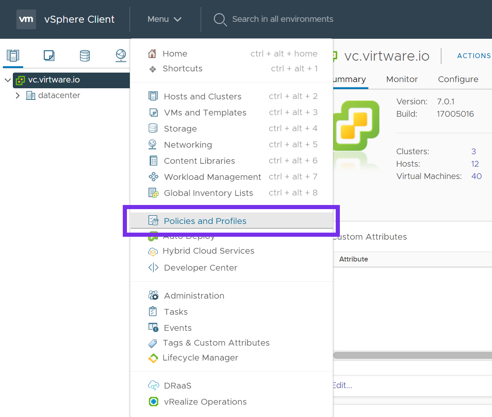
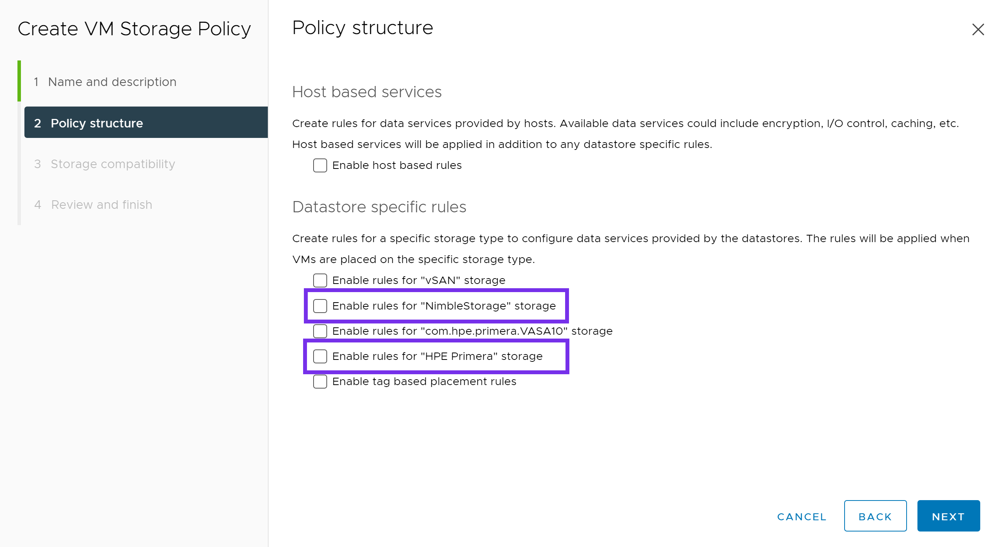
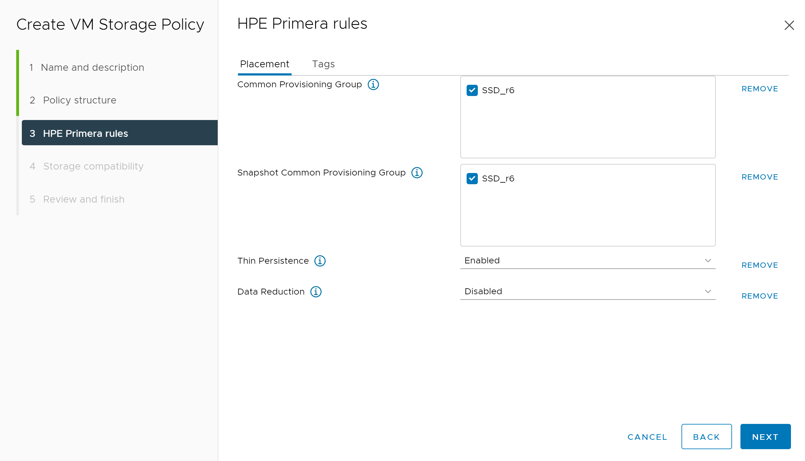
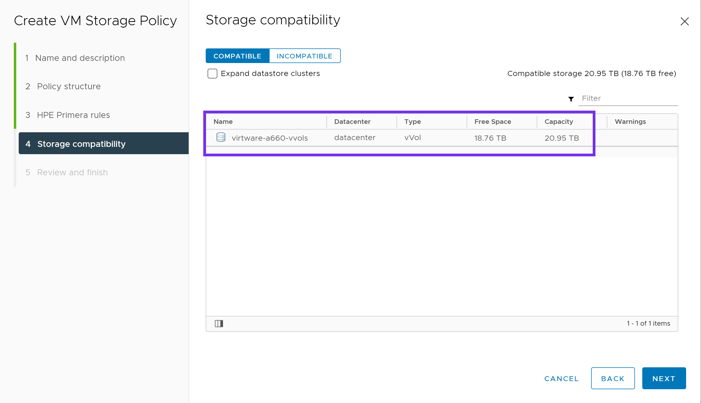
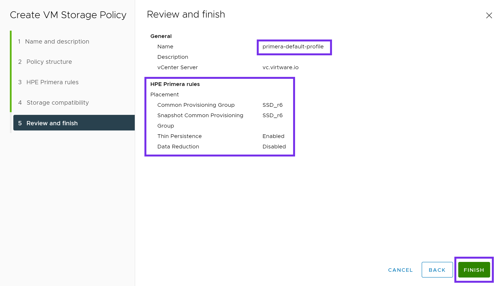
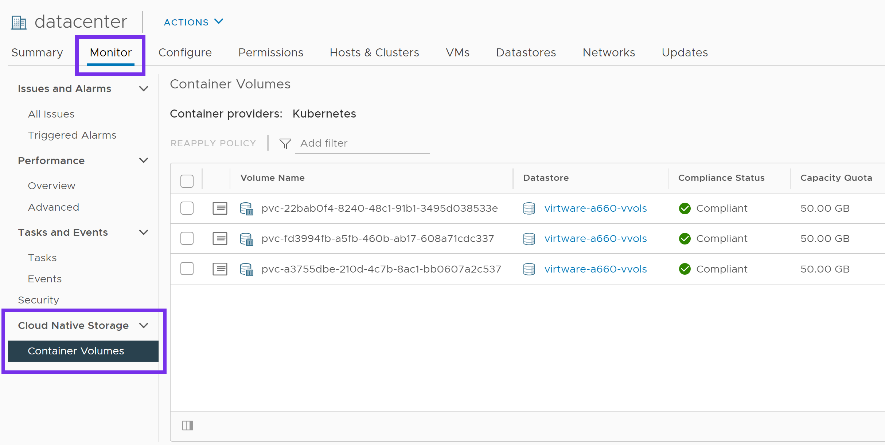

# Cloud Native Storage for vSphere

Cloud Native Storage (CNS) for vSphere exposes vSphere storage and features to Kubernetes users and was introduced in vSphere 6.7 U3. CNS is made up of two parts, a Container Storage Interface (CSI) driver for Kubernetes used to provision storage on vSphere and the CNS Control Plane within vCenter allowing visibility to persistent volumes through the new CNS UI within vCenter.

CNS fully supports Storage Policy-Based Management (SPBM) to provision volumes. SPBM is a feature of VMware vSphere that allows an administrator to match VM workload requirements against storage array capabilities, with the help of VM Storage Profiles. This storage profile can have multiple array capabilities and data services, depending on the underlying storage you use. HPE primary storage (HPE Primera, Nimble Storage, Nimble Storage dHCI, and 3PAR) has the largest user base of vVols in the market, due to its simplicity to deploy and ease of use.

[TOC]

### Deployment

When considering to use block storage within Kubernetes clusters running on VMware, customers need to evaluate which data protocol (FC or iSCSI) is primarily used within their virtualized environment. This will help best determine which CSI driver can be deployed within your Kubernetes clusters. 

!!! Important
    Due to limitations when exposing physical hardware (i.e. Fibre Channel Host Bus Adapters) to virtualized guest OSs and if iSCSI is not an available, HPE recommends the use of the VMware vSphere CSI driver to deliver block-based persistent storage from HPE Primera, Nimble Storage, Nimble Storage dHCI or 3PAR arrays to Kubernetes clusters within VMware environments for customers who are using the Fibre Channel protocol. 
    <br /><br />
    The HPE CSI Driver for Kubernetes does not support N_Port ID Virtualization (NPIV).

|  Protocol   | HPE CSI Driver for Kubernetes | vSphere CSI driver | 
| ------ | :--------: | :---------: | 
| FC | **Not** supported | Supported* |
| iSCSI | Supported | Supported* |

`*` = Limited to the SPBM implementation of the underlying storage array

#### Prerequisites

This guide will cover the configuration and deployment of the vSphere CSI driver. Cloud Native Storage for vSphere uses the VASA provider and Storage Policy Based Management (SPBM) to create First Class Disks on supported arrays. 

CNS supports VMware vSphere 6.7 U3 and higher.

##### Configuring the VASA provider

Refer to the following guides to configure the VASA provider and create a vVol Datastore.

| Storage Array | Guide |
| ------ | ------ |
| HPE Primera | [VMware vVols with HPE Primera Storage](https://support.hpe.com/hpesc/public/docDisplay?docId=a00101451en_us)  |
| HPE Nimble Storage & <br /> HPE Nimble Storage dHCI | [Working with VMware Virtual Volumes](https://infosight.hpe.com/InfoSight/media/cms/active/public/pubs_VMware_Integration_Guide_NOS_50x.whz/ddd1480379576971.html) |
| HPE 3PAR | [Implementing VMware Virtual Volumes on HPE 3PAR StoreServ](https://h20195.www2.hpe.com/v2/getpdf.aspx/4AA5-6907ENW.pdf) |

##### Configuring a VM Storage Policy

Once the vVol Datastore is created, create a VM Storage Policy. From the vSphere Web Client, click **Menu** and select **Policies and Profiles**.



Click on **VM Storage Policies**, and then click **Create**.


Next provide a name for the policy. Click **NEXT**.


Under **Datastore specific rules**, select either: 

* Enable rules for "NimbleStorage" storage 
* Enable rules for "HPE Primera" storage 

Click **NEXT**.



Next click **ADD RULE**. Choose from the various options available to your array.


Below is an example of a VM Storage Policy for Primera. This may vary depending on your requirements and options available within your array. Once complete, click **NEXT**.



Under Storage compatibility, verify the correct vVol datastore is shown as compatible to the options chosen in the previous screen. Click **NEXT**.



Verify everything looks correct and click **FINISH**. Repeat this process for any additional Storage Policies you may need.



Now that we have configured a Storage Policy, we can proceed with the deployment of the vSphere CSI driver.

#### Install the vSphere Cloud Provider Interface (CPI)

This is adapted from the following tutorial, please read over to understand all of the vSphere, firewall and guest OS requirements.

* [Deploying a Kubernetes Cluster on vSphere with CSI and CPI](https://cloud-provider-vsphere.sigs.k8s.io/tutorials/kubernetes-on-vsphere-with-kubeadm.html)

!!! Note
    The following is a simplified single-site configuration to demonstrate how to deploy the vSphere CPI and CSI drivers. Make sure to adapt the configuration to match your environment and needs.

##### Create a CPI ConfigMap

Create a `vsphere.conf` file. 

Make sure to set the vCenter server IP and vCenter datacenter object name to match your environment. For example, here we have the `tenant-k8s` configured with the vCenter IP `192.168.1.30` and the vCenter datacenter object `Houston-DC`.

Copy and paste the following.
```markdown
# Global properties in this section will be used for all specified vCenters unless overridden in vCenter section.
global:
  port: 443
  # Set insecureFlag to true if the vCenter uses a self-signed cert
  insecureFlag: true
  # Where to find the Secret used for authentication to vCenter
  secretName: cpi-global-secret
  secretNamespace: kube-system

# vcenter section
vcenter:
  tenant-k8s:
    server: 192.168.1.30
    datacenters:
      - Houston-DC
```

Create the `ConfigMap` from the `vsphere.conf` file.

```markdown
kubectl create configmap cloud-config --from-file=vsphere.conf -n kube-system
```
##### Create a CPI Secret

The below YAML declarations are meant to be created with `kubectl create`. Either copy the content to a file on the host where `kubectl` is being executed, or copy & paste into the terminal, like this:

```markdown
kubectl create -f-
< paste the YAML >
^D (CTRL + D)
```

Next create the CPI `Secret`.

```markdown
apiVersion: v1
kind: Secret
metadata:
  name: cpi-global-secret
  namespace: kube-system
stringData:
  192.168.1.30.username: "administrator@vsphere.local"
  192.168.1.30.password: "VMware1!"
```

Inspect the `Secret` to verify it was created successfully.

```markdown
kubectl describe secret cpi-global-secret -n kube-system
```

The output is similar to this:
```markdown
Name:         cpi-global-secret
Namespace:    kube-system
Labels:       <none>
Annotations:  <none>

Type:  Opaque

Data
====
192.168.1.30.password:  8 bytes
192.168.1.30.username:  27 bytes
```

##### Check that all nodes are tainted

Before installing vSphere Cloud Controller Manager, make sure all nodes are tainted with `node.cloudprovider.kubernetes.io/uninitialized=true:NoSchedule`. When the `kubelet` is started with “external” cloud provider, this taint is set on a node to mark it as unusable. After a controller from the cloud provider initializes this node, the `kubelet` removes this taint.

To find your node names, run the following command.

```markdown
kubectl get nodes

NAME      STATUS   ROLES    AGE   VERSION
master1   Ready    master   11d   v1.19.4
node1     Ready    <none>   11d   v1.19.4
node2     Ready    <none>   11d   v1.19.4
```

To create the taint, run the following command for each node in your cluster. 

```markdown
kubectl taint node <node_name> node.cloudprovider.kubernetes.io/uninitialized=true:NoSchedule
```

Verify the taint has been applied to each node.

```markdown
kubectl describe nodes | egrep "Taints:|Name:"
```

The output is similar to this:
```markdown
Name:               master1
Taints:             node-role.kubernetes.io/master:NoSchedule
Name:               node1
Taints:             node.cloudprovider.kubernetes.io/uninitialized=true:NoSchedule
Name:               node2
Taints:             node.cloudprovider.kubernetes.io/uninitialized=true:NoSchedule
```

##### Deploy the CPI manifests

There are 3 manifests that must be deployed to install the vSphere Cloud Provider Interface (CPI). The following example applies the RBAC roles and the RBAC bindings to your Kubernetes cluster. It also deploys the Cloud Controller Manager in a DaemonSet.

```markdown
kubectl apply -f https://raw.githubusercontent.com/kubernetes/cloud-provider-vsphere/v1.2.1/manifests/controller-manager/cloud-controller-manager-roles.yaml
kubectl apply -f https://raw.githubusercontent.com/kubernetes/cloud-provider-vsphere/v1.2.1/manifests/controller-manager/cloud-controller-manager-role-bindings.yaml
kubectl apply -f https://raw.githubusercontent.com/kubernetes/cloud-provider-vsphere/v1.2.1/manifests/controller-manager/vsphere-cloud-controller-manager-ds.yaml
```

##### Verify that the CPI has been successfully deployed

Verify `vsphere-cloud-controller-manager` is running.

```markdown
kubectl rollout status ds/vsphere-cloud-controller-manager -n kube-system
daemon set "vsphere-cloud-controller-manager" successfully rolled out
```

!!! Note
    If you happen to make an error with the **vsphere.conf**, simply delete the CPI components and the `ConfigMap`, make any necessary edits to the **vsphere.conf** file, and reapply the steps above.

Now that the CPI is installed, we can proceed with deploying the vSphere CSI driver.

#### Install the vSphere Container Storage Interface (CSI) driver

The following has been adapted from the vSphere CSI driver installation guide. Refer to the official documentation for additional information on how to deploy the vSphere CSI driver.

* [vSphere CSI driver - Installation](https://vsphere-csi-driver.sigs.k8s.io/driver-deployment/installation.html)

##### Create a configuration file with vSphere credentials

Since we are connecting to block storage provided from an HPE Primera, Nimble Storage, Nimble Storage dHCI or 3PAR array, we will create a configuration file for block volumes.

Create a **csi-vsphere.conf** file.

Copy and paste the following:
```markdown
[Global]
cluster-id = "csi-vsphere-cluster"

[VirtualCenter "<IP or FQDN>"]
insecure-flag = "true"
user = "Administrator@vsphere.local"
password = "VMware1!"
port = "443"
datacenters = "<vCenter datacenter>"
```

##### Create a Kubernetes Secret for vSphere credentials

Create a Kubernetes `Secret` that will contain the configuration details to connect to your vSphere environment.

```markdown
kubectl create secret generic vsphere-config-secret --from-file=csi-vsphere.conf -n kube-system
```

Verify that the `Secret` was created successfully.

```markdown
kubectl get secret vsphere-config-secret -n kube-system
NAME                    TYPE     DATA   AGE
vsphere-config-secret   Opaque   1      43s
```

For security purposes, it is advised to remove the **csi-vsphere.conf** file.

##### Create RBAC, vSphere CSI Controller `Deployment` and vSphere CSI node `DaemonSet`

```markdown fct_label="vSphere 6.7 U3"
kubectl apply -f https://raw.githubusercontent.com/kubernetes-sigs/vsphere-csi-driver/master/manifests/v2.0.1/vsphere-67u3/vanilla/rbac/vsphere-csi-controller-rbac.yaml
kubectl apply -f https://raw.githubusercontent.com/kubernetes-sigs/vsphere-csi-driver/master/manifests/v2.0.1/vsphere-67u3/vanilla/deploy/vsphere-csi-controller-deployment.yaml
kubectl apply -f https://raw.githubusercontent.com/kubernetes-sigs/vsphere-csi-driver/master/manifests/v2.0.1/vsphere-67u3/vanilla/deploy/vsphere-csi-node-ds.yaml
```

```markdown fct_label="vSphere 7.0"
kubectl apply -f https://raw.githubusercontent.com/kubernetes-sigs/vsphere-csi-driver/master/manifests/v2.0.1/vsphere-7.0/vanilla/rbac/vsphere-csi-controller-rbac.yaml
kubectl apply -f https://raw.githubusercontent.com/kubernetes-sigs/vsphere-csi-driver/master/manifests/v2.0.1/vsphere-7.0/vanilla/deploy/vsphere-csi-controller-deployment.yaml
kubectl apply -f https://raw.githubusercontent.com/kubernetes-sigs/vsphere-csi-driver/master/manifests/v2.0.1/vsphere-7.0/vanilla/deploy/vsphere-csi-node-ds.yaml
```

##### Verify the vSphere CSI driver deployment

Verify that the vSphere CSI driver has been successfully deployed using `kubectl rollout status`.

```markdown
kubectl rollout status deployment/vsphere-csi-controller -n kube-system
deployment "vsphere-csi-controller" successfully rolled out

kubectl rollout status ds/vsphere-csi-node -n kube-system
daemon set "vsphere-csi-node" successfully rolled out
```

Verify that the vSphere CSI driver `CustomResourceDefinition` has been registered with Kubernetes.

```markdown
kubectl describe csidriver/csi.vsphere.vmware.com
Name:         csi.vsphere.vmware.com
Namespace:
Labels:       <none>
Annotations:  <none>
API Version:  storage.k8s.io/v1
Kind:         CSIDriver
Metadata:
  Creation Timestamp:  2020-11-21T06:27:23Z
  Managed Fields:
    API Version:  storage.k8s.io/v1beta1
    Fields Type:  FieldsV1
    fieldsV1:
      f:metadata:
        f:annotations:
          .:
          f:kubectl.kubernetes.io/last-applied-configuration:
      f:spec:
        f:attachRequired:
        f:podInfoOnMount:
        f:volumeLifecycleModes:
    Manager:         kubectl-client-side-apply
    Operation:       Update
    Time:            2020-11-21T06:27:23Z
  Resource Version:  217131
  Self Link:         /apis/storage.k8s.io/v1/csidrivers/csi.vsphere.vmware.com
  UID:               bcda2b5c-3c38-4256-9b91-5ed248395113
Spec:
  Attach Required:    true
  Pod Info On Mount:  false
  Volume Lifecycle Modes:
    Persistent
Events:  <none>
```

Also verify that the vSphere CSINodes `CustomResourceDefinition` has been created.
```markdown
kubectl get csinodes -o=jsonpath='{range .items[*]}{.metadata.name}{"\t"}{.spec.drivers[].name}{"\n"}{end}'
master1 csi.vsphere.vmware.com
node1   csi.vsphere.vmware.com
node2   csi.vsphere.vmware.com
```

If there are no errors, the vSphere CSI driver has been successfully deployed.

##### Create a StorageClass

With the vSphere CSI driver deployed, lets create a `StorageClass` that can be used by the CSI driver. 

!!! Important
    The following steps will be using the example VM Storage Policy created at the beginning of this guide. If you do not have a Storage Policy available, refer to [Configuring a VM Storage Policy](#configuring_a_vm_storage_policy) before proceeding to the next steps.

```markdown
kind: StorageClass
apiVersion: storage.k8s.io/v1
metadata:
  name: primera-default-sc
  annotations:
    storageclass.kubernetes.io/is-default-class: "true"
provisioner: csi.vsphere.vmware.com
parameters:
  storagepolicyname: "primera-default-profile"
  fstype: xfs
```

### Validate

With the vSphere CSI driver deployed and a `StorageClass` available, lets run through some tests to verify it is working correctly.

In this example, we will be deploying a stateful MongoDB application with 3 replicas. The persistent volumes deployed by the vSphere CSI driver will be created using the VM Storage Policy and placed on a compatible vVol datastore.

##### Create and Deploy a MongoDB Helm chart

This is an example MongoDB chart using a StatefulSet. The default volume size is **8Gi**, if you want to change that use `--set persistence.size=50Gi`.

```markdown
helm install mongodb \
    --set architecture=replicaset \
    --set replicaSetName=mongod \
    --set replicaCount=3 \
    --set auth.rootPassword=secretpassword \
    --set auth.username=my-user \
    --set auth.password=my-password \
    --set auth.database=my-database \
    bitnami/mongodb
```

Verify that the MongoDB application has been deployed. Wait for pods to start running and PVCs to be created for each replica.

```markdown
kubectl rollout status sts/mongodb
```

Inspect the `Pods` and `PersistentVolumeClaims`.

```markdown
kubectl get pods,pvc
NAME       READY   STATUS    RESTARTS   AGE
mongod-0   1/1     Running   0          90s
mongod-1   1/1     Running   0          71s
mongod-2   1/1     Running   0          44s

NAME                STATUS   VOLUME                                     CAPACITY   ACCESS MODES   STORAGECLASS         AGE
datadir-mongodb-0   Bound    pvc-fd3994fb-a5fb-460b-ab17-608a71cdc337   50Gi       RWO            primera-default-sc   13m
datadir-mongodb-1   Bound    pvc-a3755dbe-210d-4c7b-8ac1-bb0607a2c537   50Gi       RWO            primera-default-sc   13m
datadir-mongodb-2   Bound    pvc-22bab0f4-8240-48c1-91b1-3495d038533e   50Gi       RWO            primera-default-sc   13m
```

To interact with the Mongo replica set, you can connect to the StatefulSet.

```markdown
kubectl exec -it sts/mongod bash

root@mongod-0:/# df -h /bitnami/mongodb
Filesystem      Size  Used Avail Use% Mounted on
/dev/sdb         49G  374M   47G   1% /bitnami/mongodb
```

We can see that the vSphere CSI driver has successfully provisioned and mounted the persistent volume to **/bitnami/mongodb**.

##### Verify Cloud Native Storage in vSphere

Verify that the volumes are now visible within the Cloud Native Storage interface by logging into the vSphere Web Client.

Click on **Datacenter**, then the **Monitor** tab. Expand **Cloud Native Storage** and highlight **Container Volumes**. 

From here, we can see the persistent volumes that were created as part of our MongoDB deployment. These should match the `kubectl get pvc` output from earlier. You can also monitor their storage policy compliance status.



This concludes the validations and verifies that all components of vSphere CNS (vSphere CPI and vSphere CSI drivers) are deployed and working correctly. 
