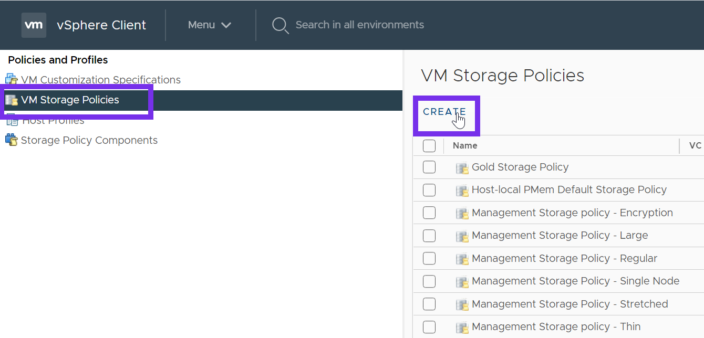
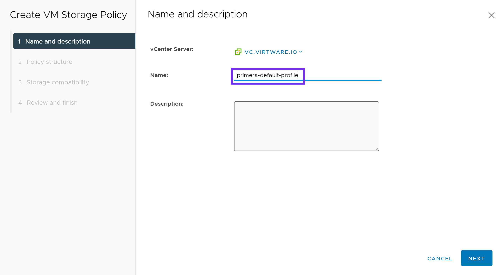
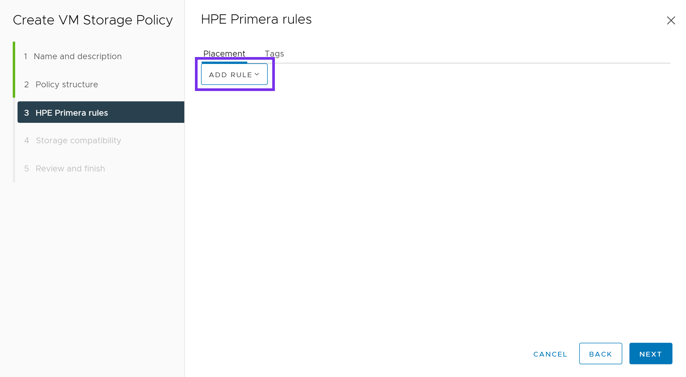

Cloud Native Storage for vSphere

# Overview

Cloud Native Storage (CNS) for vSphere exposes vSphere storage and features to Kubernetes users and was introduced in vSphere 6.7 U3. CNS is made up of two parts, a Container Storage Interface (CSI) driver for Kubernetes used to provision storage on vSphere and the CNS Control Plane within vCenter allowing visibility to persistent volumes through the new CNS UI within vCenter.

CNS fully supports Storage Policy-Based Management (SPBM) to provision volumes. SPBM is a feature of VMware vSphere that allows an administrator to match VM workload requirements against storage array capabilities, with the help of VM Storage profiles. This storage profile can have multiple array capabilities and data services, depending on the underlying storage you use. HPE Storage (HPE Primera, Nimble Storage, and HPE 3PAR) has the largest user base of vVols in the market, due to its simplicity to deploy and ease of use.

[TOC]

### Deployment

When considering to use block storage within Kubernetes clusters running on VMware, customers need to evaluate which data protocol (FC or iSCSI) is primarily used within their virtualized enviroment. This will help best determine which CSI Driver can be deployed within your Kubernetes clusters. 

!!! Important
    Due to limitations when exposing physical hardware (i.e. Fibre Channel Host Bus Adapters) to virtualized guest OSs and if iSCSI is not an available, HPE recommends the use of the VMware vSphere CSI Driver to deliver block-based persistent storage from HPE Primera, Nimble Storage or HPE 3PAR arrays to Kubernetes clusters within VMware environments for customers who are using the Fibre Channel protocol. 
    <br><br>
    The HPE CSI Driver for Kubernetes does not support N_Port ID Virtualization (NPIV).

|  Protocol   | HPE CSI Driver | vSphere CSI Driver | 
| ------ | :--------: | :---------: | 
| FC | - | X |
| iSCSI | X | X |

#### Prerequisites

This guide will cover the configuration and deployment of the vSphere CSI Driver. Cloud Native Storage for vSphere uses the VASA provider and Storage Policy Based Management (SPBM) to create First Class disks on supported arrays. 

CNS supports VMware vSphere 6.7 U3 and higher.

##### Configuring the VASA provider

Refer to the following guides to configure the VASA provider and create a vVOL Datastore.

| Storage Array | Guide |
| ------ | ------ |
| HPE Primera | [VMware vVOLs with HPE Primera Storage](https://support.hpe.com/hpesc/public/docDisplay?docId=a00101451en_us)  |
| Nimble Storage | [Working with VMware Virtual Volumes](https://infosight.hpe.com/InfoSight/media/cms/active/public/pubs_VMware_Integration_Guide_NOS_50x.whz/ddd1480379576971.html) |
| HPE 3PAR | [Implementing VMware Virtual Volumes on HPE 3PAR StoreServ](https://h20195.www2.hpe.com/v2/getpdf.aspx/4AA5-6907ENW.pdf) |

##### Configuring a VM Storage Policy

Once the vVol Datastore is created, create a VM Storage Policy. From the vSphere Web Client, click **Menu** and select **Policies and Profiles**.


Click on **VM Storage Policies**, and then click **Create**.



Next provide a name for the policy.



Under **Datastore specific rules**, select **Enable rules for "HPE Primera"** or **NimbleStorage**. 


Next click **ADD RULE**. Below is an example of a VM Storage Policy for Primera. This may vary depending on your requirements and options available within your array. Once complete, click **Next**.



Verify the vVOL datastore is listed under Compatible storage.


Once complete click **Finish**. Repeat this process for any additional Storage Policies you may need.


Now that we have configured a Storage Policy, we can deploy the vSphere CSI Driver.

#### Install the vSphere Cloud Provider Interface

This is adapted from the following tutorial, please read over to understand all of the vSphere, firewall and Guest OS requirements.

[Deploying a Kubernetes Cluster on vSphere with CSI and CPI](https://cloud-provider-vsphere.sigs.k8s.io/tutorials/kubernetes-on-vsphere-with-kubeadm.html)

!!! Note
    The following is an simplified single-site configuration to demonstrate how to deploy the vSphere CPI and CSI Driver. Make sure to adapt the configuration to match your environment and needs.


##### Create a CPI ConfigMap

The following steps are only done on the master node.

Create `/etc/kubernetes/vsphere.conf`. Make sure to set the vCenter server IP and vCenter datacenter object name to match your environment. For example, here we have the `tenant-k8s` configured with the vCenter IP `192.168.1.30` and the vCenter datacenter object `Houston-DC`.

```markdown
vi /etc/kubernetes/vsphere.conf

# Global properties in this section will be used for all specified vCenters unless overriden in VirtualCenter section.
global:
  port: 443
  # set insecureFlag to true if the vCenter uses a self-signed cert
  insecureFlag: true
  # settings for using k8s secret
  secretName: cpi-global-secret
  secretNamespace: kube-system

# vcenter section
vcenter:
  tenant-k8s:
    server: 192.168.1.30
    datacenters:
      - Houston-DC
```

Create the `ConfigMap` from the `vsphere.conf` file.

```markdown
kubectl create configmap cloud-config --from-file=/etc/kubernetes/vsphere.conf -n kube-system
```
##### Create a CPI Secret

Next create the CPI `Secret`.

```markdown
kubectl create -f-
```
Copy and paste the following:
```markdown
apiVersion: v1
kind: Secret
metadata:
  name: cpi-global-secret
  namespace: kube-system
stringData:
  192.168.1.30.username: "administrator@vsphere.local"
  192.168.1.30.password: "VMware1!"

```

Press **Enter** and **Ctrl-D**.

Inspect the `Secret` to verify it was created successfully.

```markdown
kubectl describe secret cpi-global-secret -n kube-system
```

The output is similar to this:
```markdown
Name:         cpi-global-secret
Namespace:    kube-system
Labels:       <none>
Annotations:  <none>

Type:  Opaque

Data
====
192.168.1.30.password:  8 bytes
192.168.1.30.username:  27 bytes
```

##### Check that all nodes are tainted

Before installing vSphere Cloud Controller Manager, make sure all nodes are tainted with `node.cloudprovider.kubernetes.io/uninitialized=true:NoSchedule`. When the `kubelet` is started with “external” cloud provider, this taint is set on a node to mark it as unusable. After a controller from the cloud provider initializes this node, the `kubelet` removes this taint.

To find your node names, run the following command.

```markdown
kubectl get nodes

NAME      STATUS   ROLES    AGE   VERSION
master1   Ready    master   11d   v1.19.4
node1     Ready    <none>   11d   v1.19.4
node2     Ready    <none>   11d   v1.19.4
```

To create the taint, run the following command for each node in your cluster. 

```markdown
kubectl taint node <node_name> node.cloudprovider.kubernetes.io/uninitialized=true:NoSchedule
```

Verify the taint has been applied to each node.

```markdown
kubectl describe nodes | egrep "Taints:|Name:"
```

The output is similar to this:
```markdown
Name:               master1
Taints:             node-role.kubernetes.io/master:NoSchedule
Name:               node1
Taints:             node.cloudprovider.kubernetes.io/uninitialized=true:NoSchedule
Name:               node2
Taints:             node.cloudprovider.kubernetes.io/uninitialized=true:NoSchedule
```

##### Deploy the CPI manifests
There are 3 manifests that must be deployed to install the vSphere Cloud Provider Interface. The following example applies the RBAC roles and the RBAC bindings to your Kubernetes cluster. It also deploys the Cloud Controller Manager in a DaemonSet.

```markdown
# kubectl apply -f https://raw.githubusercontent.com/kubernetes/cloud-provider-vsphere/master/manifests/controller-manager/cloud-controller-manager-roles.yaml
clusterrole.rbac.authorization.k8s.io/system:cloud-controller-manager created

# kubectl apply -f https://raw.githubusercontent.com/kubernetes/cloud-provider-vsphere/master/manifests/controller-manager/cloud-controller-manager-role-bindings.yaml
clusterrolebinding.rbac.authorization.k8s.io/system:cloud-controller-manager created

# kubectl apply -f https://github.com/kubernetes/cloud-provider-vsphere/raw/master/manifests/controller-manager/vsphere-cloud-controller-manager-ds.yaml
serviceaccount/cloud-controller-manager created
daemonset.extensions/vsphere-cloud-controller-manager created
service/vsphere-cloud-controller-manager created
```

##### Verify that the CPI has been successfully deployed

Verify `vsphere-cloud-controller-manager` is running.

```markdown
kubectl get pods -n kube-system
```

The output is similar to this:
```markdown
NAME                                       READY   STATUS    RESTARTS   AGE
calico-kube-controllers-5c6f6b67db-zt29v   1/1     Running   0          11d
calico-node-g2lkh                          1/1     Running   0          11d
calico-node-jx4sf                          1/1     Running   0          11d
calico-node-z568z                          1/1     Running   0          11d
coredns-f9fd979d6-2gbtm                    1/1     Running   0          11d
coredns-f9fd979d6-j5lrf                    1/1     Running   0          11d
etcd-master1                               1/1     Running   0          11d
kube-apiserver-master1                     1/1     Running   0          11d
kube-controller-manager-master1            1/1     Running   0          11d
kube-proxy-9q8hw                           1/1     Running   0          11d
kube-proxy-k85m9                           1/1     Running   0          11d
kube-proxy-qmksv                           1/1     Running   0          11d
kube-scheduler-master1                     1/1     Running   0          11d
vsphere-cloud-controller-manager-2hht9     1/1     Running   0          25s
```

##### Check that all nodes are untainted

Verify `node.cloudprovider.kubernetes.io/uninitialized` taint is removed from all nodes.

```markdown
kubectl describe nodes | egrep "Taints:|Name:"
```

The output is similar to this:
```markdown
Name:               master1
Taints:             node-role.kubernetes.io/master:NoSchedule
Name:               node1
Taints:             <none>
Name:               node2
Taints:             <none>
```

!!! Note
    If you happen to make an error with the **vsphere.conf**, simply delete the CPI components and the `ConfigMap`, make any necessary edits to the **/etc/kubernetes/vsphere.conf** file, and reapply the steps above.

Remove the **/etc/kubernetes/vsphere.conf** file.

Now that the CPI is installed, we can proceed with deploying the vSphere CSI Driver.

#### Install vSphere Container Storage Interface (CSI) Driver

The following has been adapted from the vSphere CSI Driver installation guide. Refer to [https://vsphere-csi-driver.sigs.k8s.io/driver-deployment/installation.html](https://vsphere-csi-driver.sigs.k8s.io/driver-deployment/installation.html) for additional information on how to deploy the vSphere CSI Driver.

##### Create a configuration file with vSphere credentials

Since we are connecting to block storage provided from an HPE Primera, Nimble Storage or 3PAR array, we will create a configuration file for block volumes.

Create **csi-vsphere.conf** file.

```markdown
vi /etc/kubernetes/csi-vsphere.conf
```

Copy and paste the following:

```markdown
[Global]
cluster-id = "csi-vsphere-cluster"

[VirtualCenter "<IP or FQDN>"]
insecure-flag = "true"
user = "Administrator@vsphere.local"
password = "VMware1!"
port = "443"
datacenters = "<vCenter datacenter>"
```

##### Create a Kubernetes Secret for vSphere credentials

Create a Kubernetes ``Secret` that will contain the configuration details to connect to your vSphere environment.

```markdown
kubectl create secret generic vsphere-config-secret --from-file=csi-vsphere.conf -n kube-system
```

Verify that the `Secret` was created successfully.

```markdown
kubectl get secret vsphere-config-secret -n kube-system
NAME                    TYPE     DATA   AGE
vsphere-config-secret   Opaque   1      43s
```

For security purposes, it is advised to remove the **csi-vsphere.conf** file.

```markdown
rm csi-vsphere.conf
```

##### Create Roles, ServiceAccount and ClusterRoleBinding for the vSphere CSI Driver

Create `ClusterRole`, `ServiceAccounts` and `ClusterRoleBinding` needed for installation of vSphere CSI Driver

```markdown
kubectl apply -f https://raw.githubusercontent.com/kubernetes-sigs/vsphere-csi-driver/master/manifests/v2.0.0/vsphere-7.0/vanilla/rbac/vsphere-csi-controller-rbac.yaml
```

##### Deploy the vSphere CSI Driver

vSphere CSI Controller `Deployment`:

```markdown
kubectl apply -f https://raw.githubusercontent.com/kubernetes-sigs/vsphere-csi-driver/master/manifests/v2.0.0/vsphere-7.0/vanilla/deploy/vsphere-csi-controller-deployment.yaml
```

vSphere CSI node `Daemonset`:

```markdown
kubectl apply -f https://raw.githubusercontent.com/kubernetes-sigs/vsphere-csi-driver/master/manifests/v2.0.0/vsphere-7.0/vanilla/deploy/vsphere-csi-node-ds.yaml
```

##### Verify the vSphere CSI Driver deployment

To verify that the vSphere CSI driver has been successfully deployed, the `vsphere-csi-controller` deployment should be in ready state and an instance of the `vsphere-csi-node` running on each of the worker nodes.

```markdown
kubectl get deployment -n kube-system
NAME                          READY   AGE
vsphere-csi-controller        1/1     2m58s

kubectl get daemonsets vsphere-csi-node -n kube-system
NAME               DESIRED   CURRENT   READY   UP-TO-DATE   AVAILABLE   NODE SELECTOR   AGE
vsphere-csi-node   2         2         2       2            2           <none>          3m51s
```


Verify that the vSphere **csidrivers** `CustomResourceDefinition` has been registered with Kubernetes.

```markdown
kubectl describe csidrivers
  Name:         csi.vsphere.vmware.com
  Namespace:
  Labels:       <none>
  Annotations:  <none>
  API Version:  storage.k8s.io/v1beta1
  Kind:         CSIDriver
  Metadata:
    Creation Timestamp:  2020-11-25T20:46:07Z
    Resource Version:    2382881
    Self Link:           /apis/storage.k8s.io/v1beta1/csidrivers/csi.vsphere.vmware.com
    UID:                 19afbecd-bc2f-4806-860f-b29e20df3074
  Spec:
    Attach Required:    true
    Pod Info On Mount:  false
    Volume Lifecycle Modes:
      Persistent
  Events:  <none>
```

Also verify that the vSphere **CSINodes** `CustomResourceDefinition` has been created.

```markdown
kubectl get CSINode
NAME      DRIVERS   AGE
master1   1          5m
node1     1          5m
node2     1          5m
```

If there are no errors, the vSphere CSI Driver has been successfully deployed.

### Validate the vSphere CSI Driver

With the vSphere CSI Driver deployed, lets run through some tests to verify it is working correctly.

!!! Important
    The following steps will be using the example VM Storage Policy created at the beginning of this guide. If you do not have a Storage Policy available, refer to [Configuring a VM Storage Policy](#configuring_a_vm_storage_policy) before proceeding to the next steps.

In this example, we will be deploying a stateful MongoDB application with 3 replicas. The persistent volumes deployed by the vSphere CSI Driver will be created using the VM Storage Policy and placed on a compatible vVOL datastore.

##### Create a StorageClass

Create the `StorageClass` that will be used for the MongoDB deployment. We will use the Storage Policy created earlier as an example. Make sure to change the Storage Policy name to match your setup.

```markdown
kubectl create -f- 
```

Copy and paste the following:
```markdown
kind: StorageClass
apiVersion: storage.k8s.io/v1
metadata:
  name: sc-mongodb
  annotations:
    storageclass.kubernetes.io/is-default-class: "true"
provisioner: csi.vsphere.vmware.com
parameters:
  storagepolicyname: "primera-default-profile"
  fstype: ext4
```

Press **Enter** and **Ctrl-D**.

Inspect the `StorageClass` to verify it was created successfully.

```markdown
kubectl get sc sc-mongodb
```

##### Create and Deploy a MongoDB StatefulSet

Define and deploy a StatefulSet that specifies the number of replicas to be used for your application. First, [create secret for the key file](https://docs.mongodb.com/manual/tutorial/deploy-replica-set-with-keyfile-access-control/). MongoDB will use this key to communicate with the internal cluster. 

```markdown
openssl rand -base64 756 > mongo_key.txt
chmod 400 mongo_key.txt
```

Next create the MongoDB keyfile `Secret`.
```markdown
kubectl create secret generic shared-bootstrap-data --from-file=internal-auth-mongodb-keyfile=mongo_key.txt
secret/shared-bootstrap-data created
```

Create the MongoDB `Service` and `StatefulSet`.


```markdown
kubectl create -f- 
```

Copy and paste the following:
```markdown
---
apiVersion: v1
kind: Service
metadata:
  name: mongodb-service
  labels:
    name: mongodb-service
spec:
  ports:
  - port: 27017
    targetPort: 27017
  clusterIP: None
  selector:
    role: mongo
---
apiVersion: apps/v1
kind: StatefulSet
metadata:
  name: mongod
spec:
  serviceName: mongodb-service
  replicas: 3
  selector:
    matchLabels:
      role: mongo
      environment: test
      replicaset: MainRepSet
  template:
    metadata:
      labels:
        role: mongo
        environment: test
        replicaset: MainRepSet
    spec:
      containers:
      - name: mongod-container
        image: mongo:3.4
        command:
        - "numactl"
        - "--interleave=all"
        - "mongod"
        - "--bind_ip"
        - "0.0.0.0"
        - "--replSet"
        - "MainRepSet"
        - "--auth"
        - "--clusterAuthMode"
        - "keyFile"
        - "--keyFile"
        - "/etc/secrets-volume/internal-auth-mongodb-keyfile"
        - "--setParameter"
        - "authenticationMechanisms=SCRAM-SHA-1"
        resources:
          requests:
            cpu: 0.2
            memory: 200Mi
        ports:
        - containerPort: 27017
        volumeMounts:
        - name: secrets-volume
          readOnly: true
          mountPath: /etc/secrets-volume
        - name: mongodb-persistent-storage
          mountPath: /data/db
      volumes:
      - name: secrets-volume
        secret:
          secretName: shared-bootstrap-data
          defaultMode: 256
  volumeClaimTemplates:
  - metadata:
      name: mongodb-persistent-storage
      annotations:
        volume.beta.kubernetes.io/storage-class: "sc-mongodb"
    spec:
      accessModes: [ "ReadWriteOnce" ]
      resources:
        requests:
          storage: 50Gi
```
Press **Enter** and **Ctrl-D**.

Verify that the MongoDB application has been deployed. Wait for pods to start running and PVCs to be created for each replica.

```markdown
kubectl get statefulset mongod
NAME     READY   AGE
mongod   3/3     96s
```

Inspect the pods and PersistentVolumeClaims.

```markdown
kubectl get pods,pvc
NAME       READY   STATUS    RESTARTS   AGE
mongod-0   1/1     Running   0          90s
mongod-1   1/1     Running   0          71s
mongod-2   1/1     Running   0          44s

NAME                                  STATUS   VOLUME                                     CAPACITY   ACCESS MODES   STORAGECLASS   AGE
mongodb-persistent-storage-mongod-0   Bound    pvc-fd3994fb-a5fb-460b-ab17-608a71cdc337   50Gi       RWO            sc-mongodb      1m
mongodb-persistent-storage-mongod-1   Bound    pvc-a3755dbe-210d-4c7b-8ac1-bb0607a2c537   50Gi       RWO            sc-mongodb      2m
mongodb-persistent-storage-mongod-2   Bound    pvc-22bab0f4-8240-48c1-91b1-3495d038533e   50Gi       RWO            sc-mongodb      2m
```

To interact with the Mongo replica set, you can connect to the first node.

```markdown
kubectl exec -it mongod-0 -c mongod-container bash
```

Once logged into the instance, type **mongo**.

```markdown
root@mongod-0:/# mongo 
MongoDB shell version v3.4.24 
connecting to: mongodb://127.0.0.1:27017 
MongoDB server version: 3.4.24 
Welcome to the MongoDB shell. 
For interactive help, type "help". 
For more comprehensive documentation, see 
        http://docs.mongodb.org/ 
Questions? Try the support group 
        http://groups.google.com/group/mongodb-user
```

##### Verify Cloud Native Storage in vSphere

Verify that the volumes are now visible within the Cloud Native Storage interface. 

Log into the vSphere Web Client, click on Datacenter, then the Monitor tab. Expand Cloud Native Storage and highlight Container Volumes. From here, we can see the persistent volumes that were created as part of our MongoDB deployment. These should match the `kubectl get pvc` output from earlier. You can also monitor their storage policy compliance status.


This concludes the validations and verifies that all components of vSphere CNS (vSphere CPI and vSphere CSI Driver) are deployed and working correctly. 